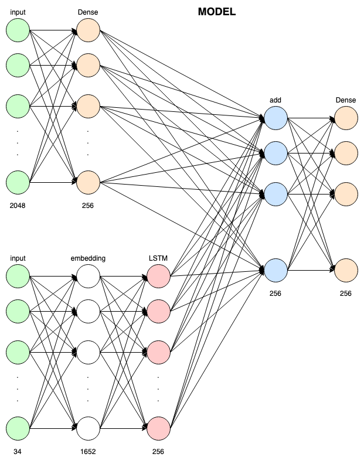
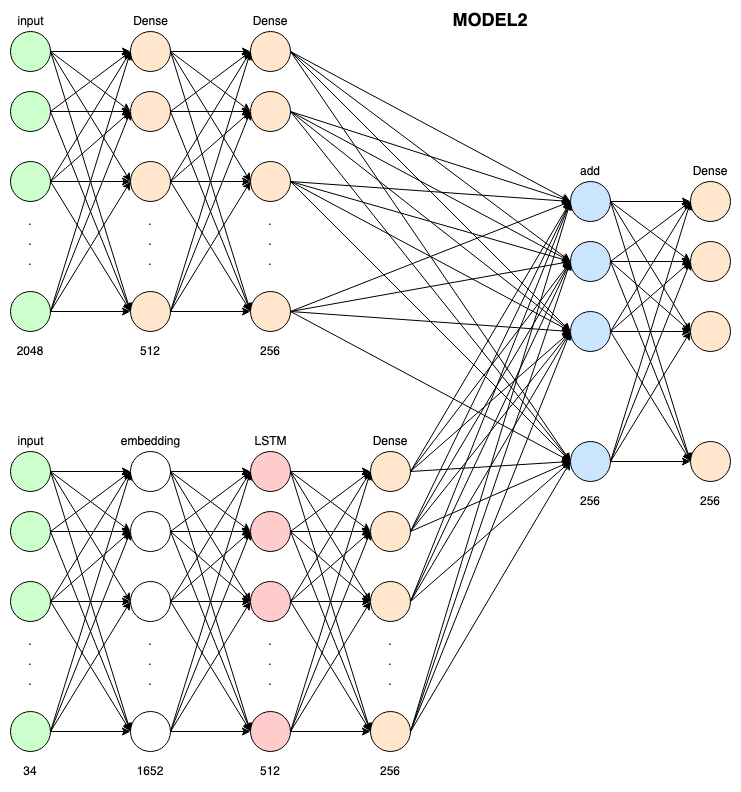
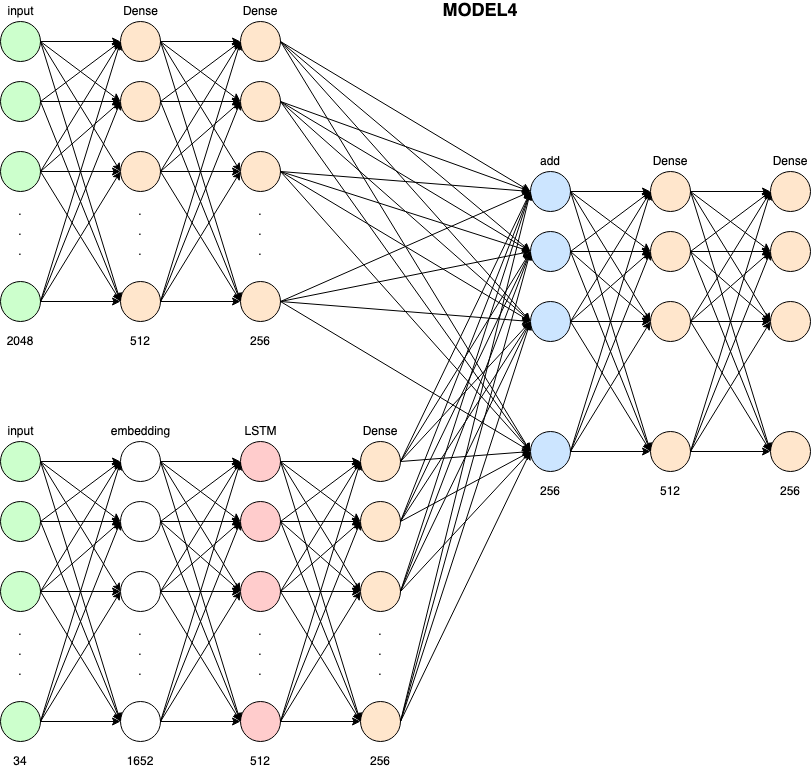
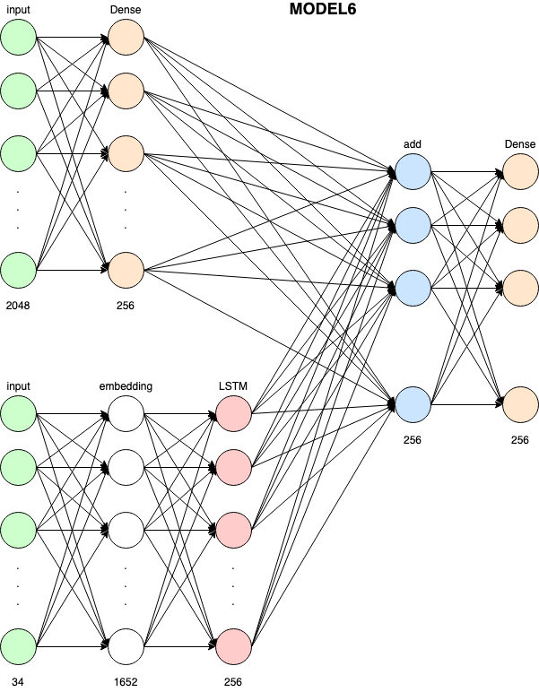

# image-captioning
## exploring image captioning
## Keras implementation Resource: https://towardsdatascience.com/image-captioning-with-keras-teaching-computers-to-describe-pictures-c88a46a311b8
## InceptionV3(1st Runner up ILSVRC 2015) Resource: https://medium.com/@sh.tsang/review-inception-v3-1st-runner-up-image-classification-in-ilsvrc-2015-17915421f77c
## ResNet(Winner of ILSVRC 2015) Resource: https://towardsdatascience.com/review-resnet-winner-of-ilsvrc-2015-image-classification-localization-detection-e39402bfa5d8
## Keras Applications API: https://keras.io/api/applications/
# MODELS TRAINED IN THIS REPO
## Branch master

## Branch deep_arch

## Branch deep_arch2

## Branch resnet152V2

## Branch resnet152V2

## Branch InceptionResNetV2

